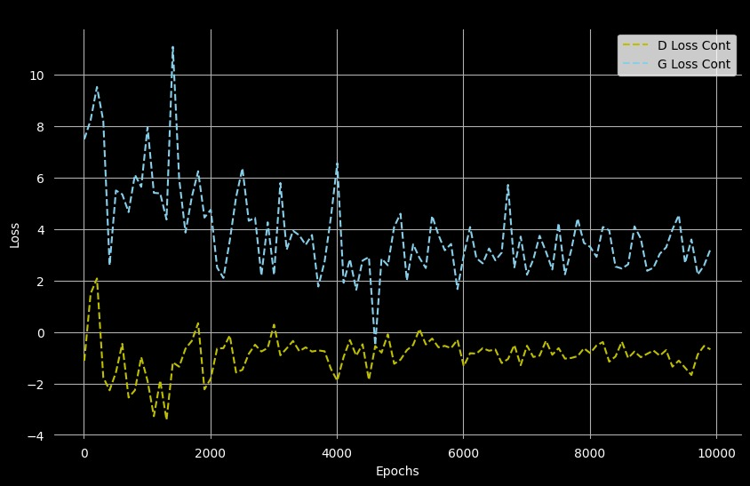
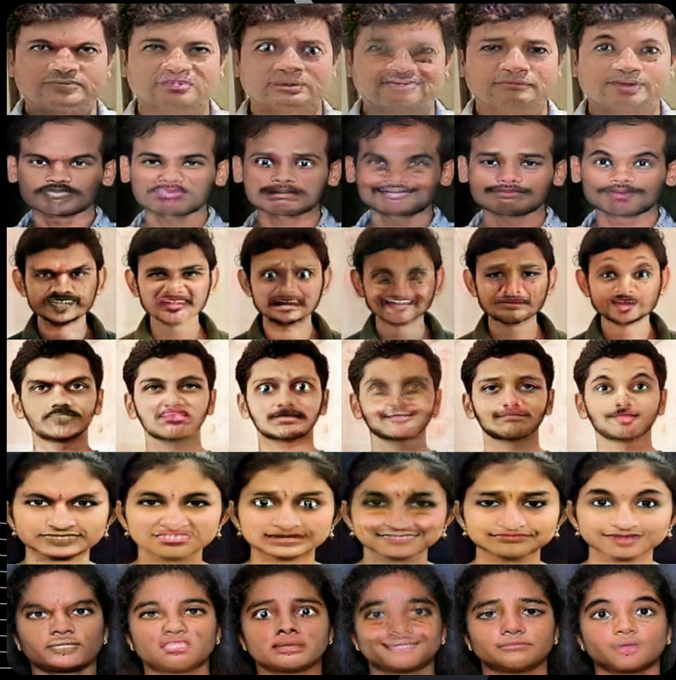

# Emotion Generation Using StarGAN

## Project Overview

Welcome to the **Emotion Generation Using StarGAN** project! This project aims to leverage the power of StarGAN (Star Generative Adversarial Network), a state-of-the-art generative model, to generate facial images with specific emotional expressions. By training on a dataset of facial images labeled with emotions (e.g., happy, sad, angry, neutral), this project will enable the transformation of a given face into different emotional states while preserving the individual's identity.

This README outlines the planned development process, tools, and setup for the project. The implementation has not yet started, but this document serves as a blueprint for what we intend to achieve.

---

## Objectives

- **Primary Goal**: Build a model capable of generating realistic facial images with user-specified emotions using StarGAN.
- **Secondary Goals**:
  - Support multi-domain image-to-image translation (e.g., multiple emotions).
  - Ensure identity preservation during emotion transformation.
  - Provide a simple interface for users to upload an image and select a target emotion.

---

## Why StarGAN?

StarGAN is chosen for this project because:
- It supports multi-domain translation with a single model, unlike traditional GANs that require separate models for each domain pair.
- It uses a unified architecture with a domain classification loss, making it efficient for emotion transformation.
- It has demonstrated strong results in facial attribute editing tasks in prior research.

---

## Planned Features

1. **Emotion Transformation**:
   - Input: A facial image and a target emotion (e.g., "happy," "sad").
   - Output: The same face with the specified emotion applied.

2. **Supported Emotions**:
   - Anger
   - Disgust
   - Fear
   - Happy
   - Neutral
   - Sad
   - Surprise

3. **User Interface** (Stretch Goal):
   - A simple web-based interface using Streamlit to upload images and select emotions.

4. **Model Training**:
   - Train StarGAN on a labeled facial emotion dataset (Scraped from google and preprocessed for custom use).
   - Fine-tune the model for high-quality outputs.

5. **Evaluation**:
   - Qualitative: Visual inspection of generated images.

---
## Loss Curves:


---
## Results:


---
## Project Structure (Planned)

```plaintext
emotion-starGAN/
├── dataset/              # Dataset storage and preprocessing scripts
│   ├── Train/            # Raw dataset files
│   └── Test/             # Preprocessed images
├── samples               # samples
│   ├── images/           
│   ├── models/
│   └── classifier
├── data_loader.py        # data loader
├── main.py               # main file with args
├── model.py              # model architecture
├── solver.py             # utilities
├── notebook.ipynb        # Preprocess Dataset
├── requirements.txt      # Python dependencies
└── README.md             # This file